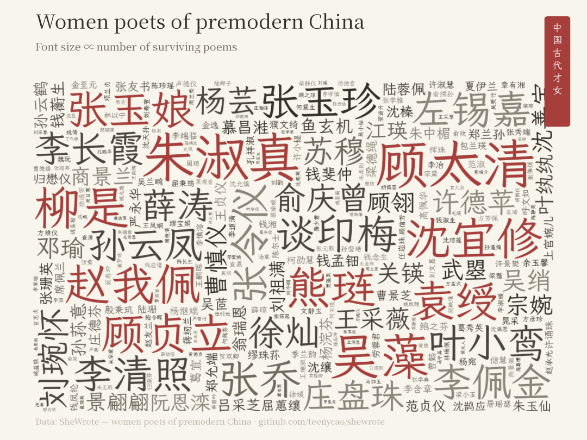
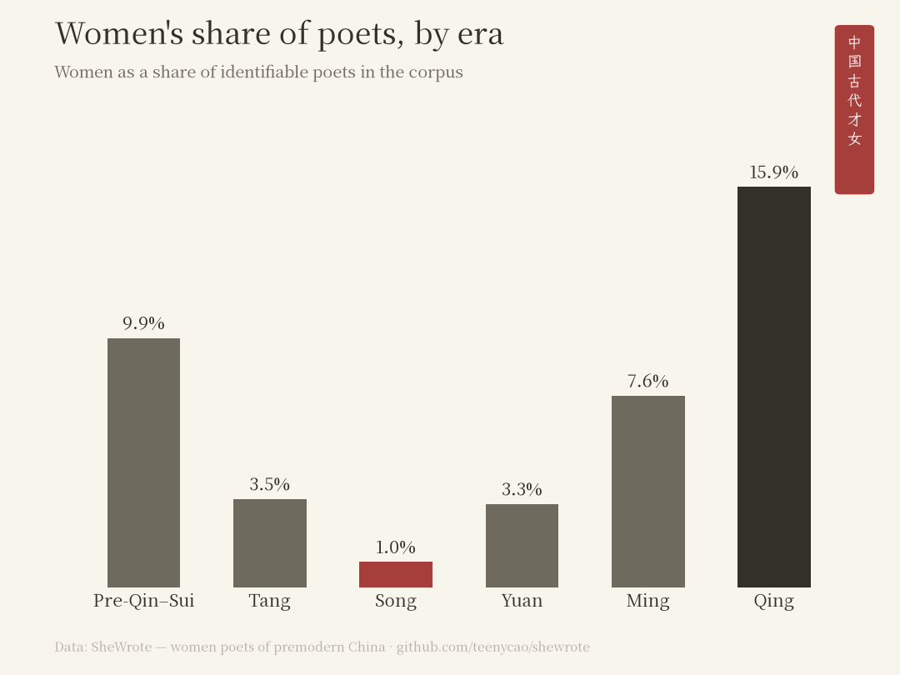
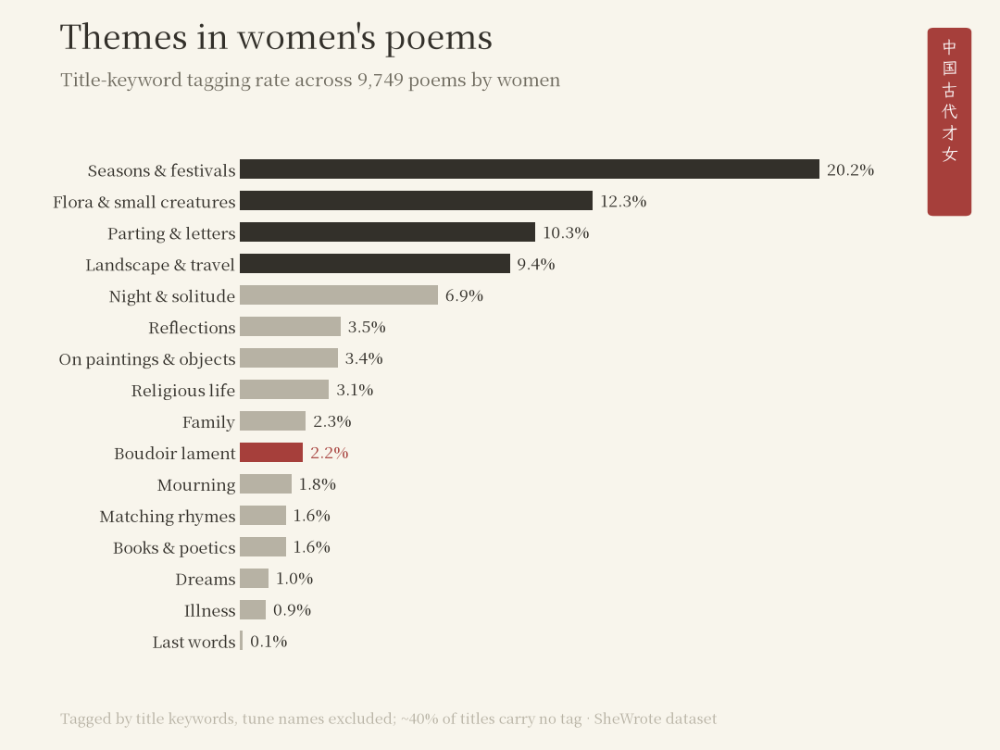
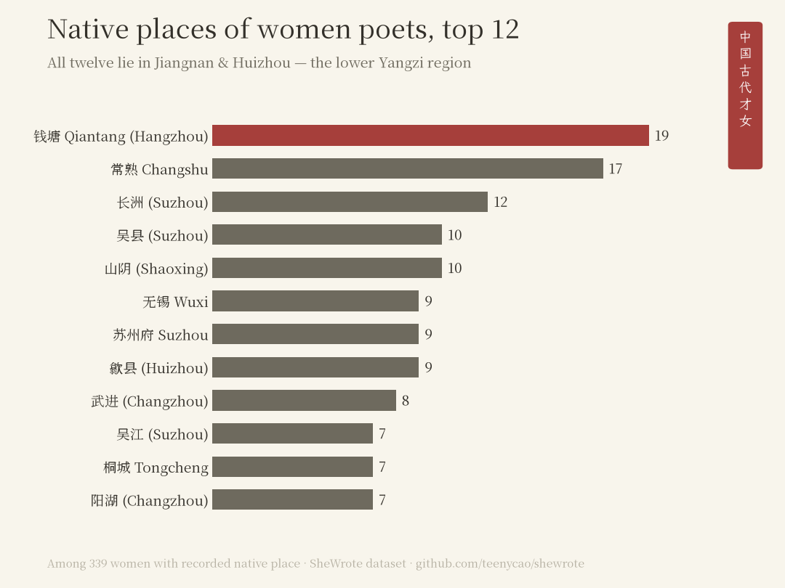

# SheWrote · 中国古代才女

**Women Poets of Premodern China: The Visible Women**

[中文说明 → README.zh.md](README.zh.md)

📖 **[Visit the archive → shewrote.teenycao.com](https://shewrote.teenycao.com/)** — every one of the 902 women has her own page: names, kinship, and every surviving poem.

**Of 763,542 classical Chinese poems from pre-Qin through Qing, only 1.50% can be attributed to women. In the most rigorously sourced Tang–Song corpus alone, the figure drops to 0.33%.**

No open dataset could answer this before — the most-starred classical-poetry corpus does not even carry a gender field. This repository is the first gender-annotated open dataset of classical Chinese poetry — built by cross-matching author names in open poetry corpora against the gender field of Harvard's [China Biographical Database (CBDB)](https://cbdb.hsites.harvard.edu/).



## Why

China has a long and luminous poetic tradition. Lines memorized half-comprehendingly in childhood resurface at countless moments later in life; poetry is how we stay emotionally connected to people who lived a thousand years ago. Then one day I noticed: the feelings I had been stepping into — friendship, love, the sorrow of parting — were almost all written by men. Even the "boudoir lament" (闺怨诗), a genre named after women, is mostly men speaking through an imagined woman. In story after story told from a male point of view, the women themselves are not present. Women need to write their own stories. So — how many women poets did premodern China actually have? What did they care about, what did they express, what made them happy, what did they worry over? I was curious about all of it. I decided to find them. They deserve to be seen.

[chinese-poetry](https://github.com/chinese-poetry/chinese-poetry) (52k+ stars) is the default data source for virtually every Chinese poetry project, with ~14,000 poets — and no gender field. Li Qingzhao and Zhu Shuzhen sit unmarked among them. Meanwhile the academic resources that could answer the question (CBDB, McGill's [Ming Qing Women's Writings](https://digital.library.mcgill.ca/mingqing/)) have no bridge to the corpora developers actually use. This dataset is that bridge.

## The numbers

Across 763,542 poems from pre-Qin through Qing:

- **Poets**: ~11,600 identifiable authors, of whom **893 are women (7.7%)**; with a few more identified in the Tang–Song-only corpus, the dataset holds **902 women**
- **Poems**: **11,481 attributed to women (1.50%)**
- **Survival per author**: women ≈ 11 poems, men ≈ 39 — a **~3.6× gap**

Per-era shares are in the dynasty chart below (Song's 1.0% is the all-time low). The stricter Tang–Song-only figure (0.33%) and the two-corpus layering method: [methodology](docs/methodology.md).

Three things these numbers say at once:

1. **Women are nearly absent from the record** — not because they didn't write (Ming-Qing China alone produced thousands of published women poets), but because of what was compiled and kept.
2. **The erasure operated twice.** Even the women who made it into the record were preserved at ~¼ the per-capita volume of men.
3. **Both figures are lower bounds.** 376 poems are signed "X氏" — *the woman of family X*, no personal name recorded. We flag them rather than count them: we refuse to launder an act of erasure into a data point. See [methodology](docs/methodology.md).







## The data

| File | What it is |
|---|---|
| [`data/out/women_profiles.csv`](data/out/women_profiles.csv) / [`.json`](data/out/women_profiles.json) | **908 rows** — 902 corpus women + 6 supplement-recovered from public-domain texts (`supplement` column; no CBDB/corpus provenance). Fields: canonical name, pinyin, dynasty, birth/death years, all recorded aliases (柳如是 has 29), social status, native place with coordinates, surviving-poem counts, MQWW cross-reference. Filter `supplement != 1` for corpus-only claims |
| [`data/out/women_poems.csv`](data/out/women_poems.csv) | **11,826 rows** of poems by resolved women authors (cross-corpus duplicates retained by design; 10,281 unique after dedup), with corpus signature ↔ canonical identity mapping |
| [`data/out/stats.json`](data/out/stats.json) | All headline numbers, machine-readable |
| `data/interim/author_match.csv` (generated) | Full audit table: every author string, its match route and bucket |

82% of the 902 women are independently confirmed by MQWW, the domain-scholar-curated database of Ming-Qing women's writings.

## Method in one paragraph

Author strings from two corpora ([chinese-poetry](https://github.com/chinese-poetry/chinese-poetry), citation-grade, Tang–Song; [Werneror/Poetry](https://github.com/Werneror/Poetry), aggregated, pre-Qin → Qing) are script-normalized (OpenCC), matched against CBDB canonical names, then against CBDB's 207k-row alias table (which resolves palace titles like 上官昭容, studio names, and taboo variants), disambiguated by era and gender-consensus rules, and bucketed with full audit trail — ~89% of poems end up gender-resolvable. Ten canonical women poets serve as a hand-verified anchor set. Full detail, bucket tables, validation, and the five reasons the numbers are lower bounds: [docs/methodology.md](docs/methodology.md).

## Reproduce

```bash
# 1. fetch inputs (not in git; ~1.5GB total) — see data/README.md
# 2. run
python3 -m venv .venv && .venv/bin/pip install -r requirements.txt
.venv/bin/python scripts/build_match.py         # matching pipeline → interim tables
.venv/bin/python scripts/build_release.py       # → women_poems.csv, stats.json
.venv/bin/python scripts/build_profiles.py      # → women_profiles (reads women_poems for dedup counts)
.venv/bin/python scripts/build_starmap_data.py  # → web/starmap_data.js
# figure scripts additionally assume macOS system fonts (Songti SC / Kaiti SC)
```

## License

- **Code**: [MIT](LICENSE)
- **Derived annotation data** (`data/out/`): [CC BY-NC-SA 4.0](https://creativecommons.org/licenses/by-nc-sa/4.0/), inherited from CBDB
- Poem texts inside `women_poems.csv` remain under their upstream MIT licenses (chinese-poetry, Werneror/Poetry); its attribution columns are CC BY-NC-SA 4.0

## Acknowledgements

Built on the work of the [CBDB project](https://cbdb.hsites.harvard.edu/) (Harvard), [Ming Qing Women's Writings](https://digital.library.mcgill.ca/mingqing/) (McGill, ed. Grace S. Fong), [chinese-poetry](https://github.com/chinese-poetry/chinese-poetry) contributors, and [Werneror/Poetry](https://github.com/Werneror/Poetry). Data engineering, fact-checking, and cross-review were assisted by Claude and Codex. Errors are ours; corrections welcome via issues.

*Part of a series on making erased women visible. 她写过 — she wrote, and the record can show it.*
