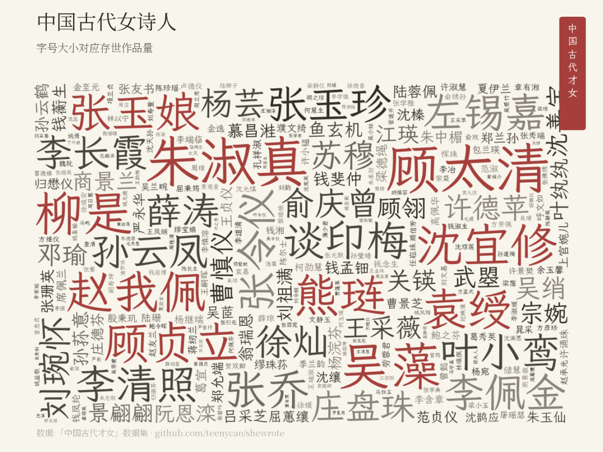
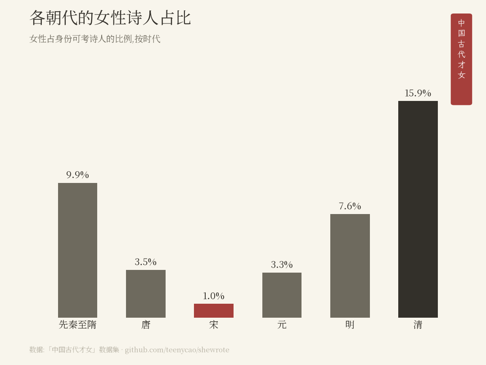
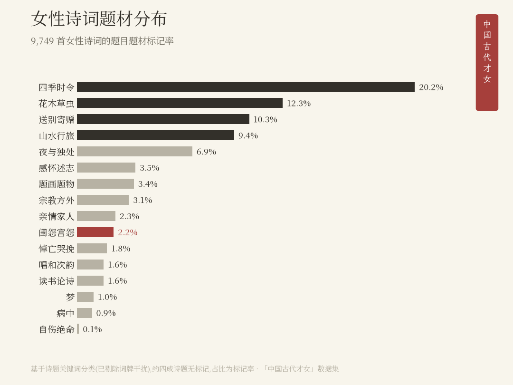
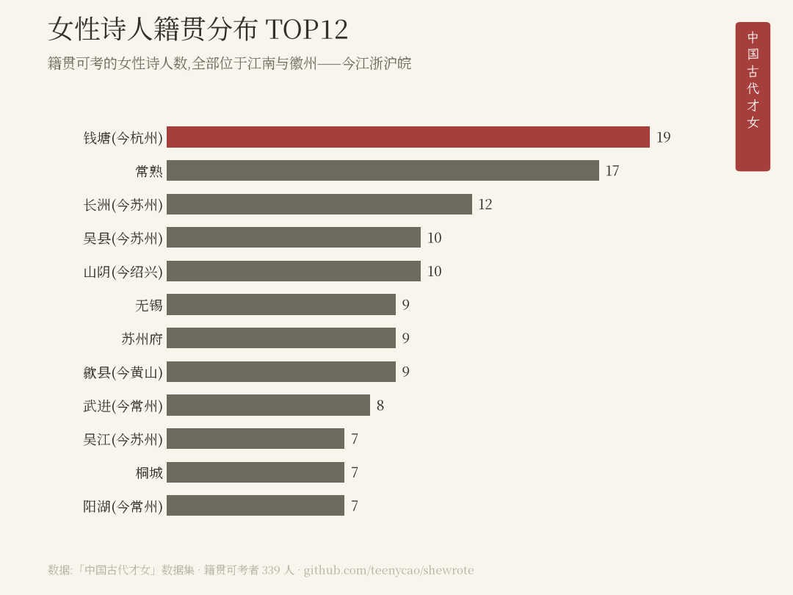

# SheWrote · 中国古代才女

**她写过——看得见的女性**

[English → README.md](README.md)

📖 **[进入档案站 → shewrote.teenycao.com](https://shewrote.teenycao.com/)**——902 位才女,每人一页:名字、亲缘、和她存世的每一首诗。

**在先秦至清的 763,542 首古典诗词中,能确认出自女性之手的只有 1.50%;若只看底本最严格的唐宋语料,这个数字是 0.33%。**

此前没有任何开源数据集能回答这个问题——最常用的古诗词语料库甚至没有性别字段。本仓库是第一份开源的古典诗词性别标注数据集——用哈佛[中国历代人物传记数据库(CBDB)](https://cbdb.hsites.harvard.edu/)的性别字段,与开源诗词语料的作者名交叉比对而成。



## 为什么

中国有非常灿烂悠远的诗歌文化。小时候懵懵懂懂的背诵会在此后的无数个时刻涌上心头。诗歌是一种我们与古人跨越时空的情感链接。但是有一天,我突然发现,这些我所代入的情感,不管是友情、爱情、离愁,大都出自男性诗人之手。即便是以女性命名的「闺怨诗」,实际上也大多是男性借闺中女儿自比。在无数个男性视角的故事里,女性本身并不在场。女性需要自己写自己的故事。中国古代到底有多少女性诗人?她们在关心什么?在表达什么?在为什么开心?在为什么忧虑?这些事我都好奇。于是,我决定把这些女性诗人找出来。她们需要被看见。

[chinese-poetry](https://github.com/chinese-poetry/chinese-poetry)(52k+ star)是几乎所有诗词项目的默认数据源,一万四千诗人,没有性别字段——李清照、朱淑真无标注地混在其中。而能回答这个问题的学术资源(CBDB、McGill [明清妇女著作库](https://digital.library.mcgill.ca/mingqing/))与开发者实际使用的语料之间没有桥。本数据集就是那座桥。

## 数字

先秦至清,763,542 首诗歌:

- **诗人**:约 11,600 位身份可考,其中女性 **893 位(7.7%)**;加上唐宋专库另外识别的几位,数据集共收录 **902 位**
- **诗歌**:确认为女性所作 **11,481 首(1.50%)**
- **人均存世**:女性约 11 首,男性约 39 首——**约 3.6 倍差**

各时代的占比见下方图表(宋代 1.0% 是全史最低)。更严格的唐宋断代口径(0.33%)与双语料分层方法见[方法论](docs/methodology.md)。

这组数字同时说了三件事:

1. **女性在记录中近乎缺席**——不是因为她们不写(仅明清就有数千名出版过作品的女诗人),而是因为「编什么、留什么」的权力不在她们手里。
2. **抹去发生了两次**:即使进入了记录的女性,人均被保存的作品量也只有男性的约四分之一。
3. **两个数字都是下界**。有 376 首诗署名「某氏」——有夫家姓氏、没有自己名字。我们标记而不猜测:拒绝把抹去行为洗成数据点;「诗留下了、名字没留下」本身就是发现之一。详见[方法论](docs/methodology.md)。







## 数据

| 文件 | 内容 |
|---|---|
| [`data/out/women_profiles.csv`](data/out/women_profiles.csv) / [`.json`](data/out/women_profiles.json) | **908 行档案**:902 位语料女性 + 6 位据公版文献补录(`supplement` 列标注,无语料出处);字段含正名、拼音、朝代、生卒、全部别名(柳如是有 29 个)、身份、籍贯与经纬度、存世作品数、MQWW 印证。按 `supplement != 1` 筛得纯语料口径 |
| [`data/out/women_poems.csv`](data/out/women_poems.csv) | **11,826 行**已确认女性作品(按设计保留跨库重复;去重后 10,281 首),含语料署名 ↔ 正名映射 |
| [`data/out/stats.json`](data/out/stats.json) | 全部核心数字,机器可读 |
| `data/interim/author_match.csv`(可复现生成) | 完整审计表:每个作者字符串的匹配路径与分桶 |

902 人中 82% 经 MQWW(明清妇女著作库,领域学者编纂)独立印证。

## 方法一段话

两个语料([chinese-poetry](https://github.com/chinese-poetry/chinese-poetry) 唐宋、底本可考;[Werneror/Poetry](https://github.com/Werneror/Poetry) 先秦至清、聚合库)的作者字符串,经 OpenCC 繁简归一后先精确匹配 CBDB 正名,再匹配其 20.7 万行别名表(可解宫廷头衔「上官昭容」、室名别号、避讳异写),继以朝代过滤与性别共识规则消歧,全部分桶留痕——约 89% 的诗歌性别可判。十位典范女诗人构成手工验证锚点集。分桶表、验证与「为什么是下界」的五条论证见 [docs/methodology.md](docs/methodology.md)。

## 复现

```bash
# 1. 获取原始数据(不入 git,共约 1.5GB)——见 data/README.md
# 2. 运行
python3 -m venv .venv && .venv/bin/pip install -r requirements.txt
.venv/bin/python scripts/build_match.py         # 匹配管线 → 中间表
.venv/bin/python scripts/build_release.py       # → women_poems.csv、stats.json
.venv/bin/python scripts/build_profiles.py      # → 档案表(读 women_poems 做去重计数)
.venv/bin/python scripts/build_starmap_data.py  # → web/starmap_data.js
# 图表脚本另需 macOS 系统字体(Songti SC / Kaiti SC)
```

## 授权

- **代码**:[MIT](LICENSE)
- **衍生标注数据**(`data/out/`):[CC BY-NC-SA 4.0](https://creativecommons.org/licenses/by-nc-sa/4.0/)(继承自 CBDB)
- women_poems.csv 中的诗歌文本沿用上游 MIT 授权(chinese-poetry、Werneror/Poetry);其归属标注列为 CC BY-NC-SA 4.0

## 致谢

本项目建立在 [CBDB](https://cbdb.hsites.harvard.edu/)(哈佛)、[明清妇女著作库](https://digital.library.mcgill.ca/mingqing/)(McGill,方秀洁主持)、[chinese-poetry](https://github.com/chinese-poetry/chinese-poetry) 与 [Werneror/Poetry](https://github.com/Werneror/Poetry) 的工作之上。感谢 Claude 与 Codex 在数据工程、事实核查与交叉审查中的协助。错误归我们,欢迎 issue 指正。

*「显化被抹去的女性」系列之一。她写过——而且记录可以证明。*
